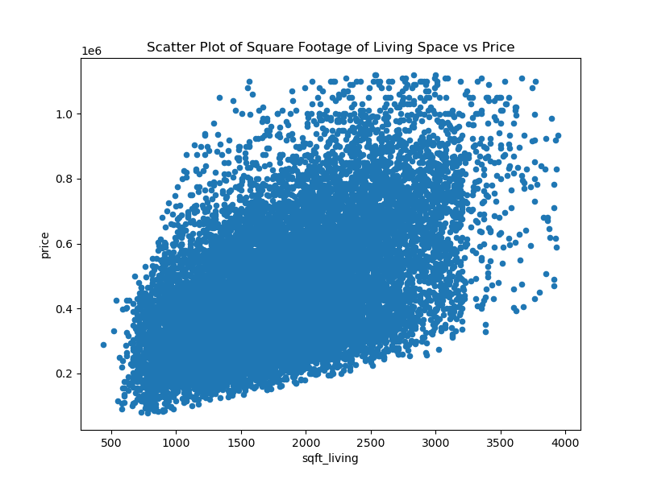

# Multiple Linear Regression: Predicting King County, WA, Housing Prices
Slides: https://docs.google.com/presentation/d/1Bi9iAwgM4gTRIIaxPXftYOwrpWMULtL3VmECbmorx98/edit?usp=sharing
## Introduction
The role assumed here is of a Data Scientist working for Stark Realtors. The Agency is in the business of helping homeowners buy and/or sell houses in King County WA in the US. The Agency has provided a dataset of house sales in King County. The task here is to model the real estate housing prices and use the model to accurately predict the housing prices based on a number of features provided within the dataset. The expectation is that once completed, the model can be used as a tool in selecting properties for investment in King County.

## Analysis Questions

This analysis will seek to answer four questions about the data:

     Question 1: Which features are most highly correlated with price?

     Question 2: How does the square footage of the home relate to the price?

     Question 3: How does the Grade of the house relate to the price?
     
     Question 4: How does the size of the house relate to the price in the neighborhood?
     
     Question 5: How doues having a view affect the price of the house?

## 2.0 DATA UNDERSTANDING

id - unique identified for a house

date - Date house was sold

price - Price is prediction target

bedrooms - Number of Bedrooms/House

bathrooms - Number of bathrooms/bedrooms

sqft_living - square footage of the home

sqft_lot - square footage of the lot

floors - Total floors (levels) in house

waterfront - House which has a view to a waterfront

view - Does the property have a view?

condition - How good the condition is ( Overall )

grade - overall grade given to the housing unit, based on King County grading system

sqft_above - square footage of house apart from basement

sqft_basement - square footage of the basement

yr_built - Built Year

yr_renovated - Year when house was renovated

zipcode - zip

lat - Latitude coordinate

long - Longitude coordinate

sqft_living15 - The square footage of interior housing living space for the nearest 15 neighbors

sqft_lot15 - The square footage of the land lots of the nearest 15 neighbors

## 3.0 DATA PREPARATION

### 3.1 imports

import pandas as pd
import numpy as np
import seaborn as sns
import matplotlib.pyplot as plt
%matplotlib inline
from sklearn.metrics import mean_absolute_error
import statsmodels.api as sm
from statsmodels.stats.outliers_influence import variance_inflation_factor
from statsmodels.formula.api import ols
from sklearn.model_selection import train_test_split
import warnings
warnings.filterwarnings('ignore')

### 3.2 Load data

df = pd.read_csv('data/kc_house_data.csv')

### 3.3 Checked to see the datatype, number of columns and rows of the dataset

Most of the data types are numeric though we have a few object data types. The total number of rows is 21,597 and the number of columns in 21

###  3.4 perform a statistical summary of the data

Count: The count of non-null values in each column. It gives you an idea of missing values or potential data quality issues.

Mean: The average value of each column. It provides a measure of central tendency and can give you a sense of the typical value.

Standard Deviation: The measure of the spread or variability of each column's values around the mean. It indicates how dispersed the data points are.

Minimum and Maximum: The smallest and largest values in each column. It gives you the range of the data and helps identify potential outliers.

Quartiles (25%, 50%, and 75%): These values divide the data into four equal parts. The 50th percentile (median) represents the middle value, while the 25th and 75th percentiles indicate the lower and upper quartiles, respectively. They provide insights into the data's distribution and skewness.

## 4.0 DATA CLEANING

### 4.1 missing data
The column waterfront has 2376 missing values, which is 11.0 % of it's total
The column view has 63 missing values, which is 0.3 % of it's total
The column yr_renovated has 3842 missing values, which is 17.8 % of it's total

### 4.2 conversion
Conversion of Date Column to two new colums 'month_sold','yr_sold'
Conversion of sqft_basement to Float/Int Type

### 4.3 Identify and deal with Outliers.

### 5.0 STATISTICAL MODELING

#### 5.1 identify variable types

numeric_variables = df.select_dtypes("number")
categorical_features = df.select_dtypes("object")

#### 5.2 Checking Correlations

A correlation of 0.7 to 1.0 (-0.7 to -1) suggests a strong positive (negative) linear relationship while 0.5 to 0.6 (-0.5 to -0.6) is considered moderate. many of the variables related to the size of homes (e.g. sqft_living, sqft_living15, etc) are strongly correlated with each other.

#### 5.3 correlation coefficients against target value
The target variable is price.

### Question 1: Which features are most highly correlated with price?

sqft_living has the strongest positive correlation with price followed by sqft_living15, sqft_above and bathrooms in that order. NOTE. we do not use lat as its not needed in the analyisis

#### 5.3.1 Plotting the sqft_living vs. Price

### 5.4 Simple Linear Regression Model

####  Setting Up Variables for Regression
Declaring y and X_base variables, where y is a Series containing price data and X_base is a DataFrame containing the column with the target variable('sqft_living)

#### Creating and Fitting Simple Linear Regression

#### calculate the mean absolute error
130267.37490037664

#### Visualize model fit

#### Visualize fitted values

#### Observations
Our model is statistically significant overall with a Prob (F-statistic) value of 0.00 which is less than the standard alpha 0.05. The model also explains about 29% of the variance in price. A higher variance is always preferred.

Both our intercept (const) and our coefficient for sqft_living are statistically significant with P>|t| values of 0.000 which are less than the standard alpha of 0.05.

Our intercept is about 144200, meaning that a home with 0 square feet of living area would cost about USD144200.

Our coefficient for sqft_living is about 169, which means that for each additional square foot of living area, we expect the price to increase by about USD 169.

A mean absolute error (MAE) of 130267.37 means that our model is off by USD 130267. This means that the difference between the actual price and the predicted price is approximately USD 130267 which is quite high. A lower MAE is always preferred.

### Question 2: How does the square footage of the home relate to the price?

Our coefficient for sqft_living is about 169, which means that for each additional square foot of living area, we expect the price to increase by about USD 169. the bigger the house the higher the price.

### 5.5 Multiple Regression Modeling

#### Setting Up Variables for Regression
correlated variables
X_multiple = ("sqft_living", "grade", "sqft_living15",'view', "sqft_above", "bedrooms")

#### Preprocessing Categorical Variable by One Hot-Encoding

#### Build a Multiple Linear Regression Model
Using the y variable from our base model and X_multiple, we build a model called multiple1_model and a regression results object called multiple1_results.

#### calculate the mean absolute error
iterated_mae = 115503.27051225638

#### plot the partial regression plots for our predictors

#### Observations
All of the coefficients are statistically significant with a P>|t| of 0.00 which is less than the standard alpha 0.05 

The intercept(const) is at 3.048e+05. This means that a house with 0 as the value for all the predictors included in the model, would cost USD 302,000.

The coefficient for sqft_living is 142.7307. This means for each additional square foot of living space, the house costs about USD 143 more. We note that this is very similar, but less than  the sqft_living coefficient for the base model of USD 169.

The coefficient for sqft_living15 is 25.2562. This means an increase of 1 square footage in average square footage of the living spaces in the neighboring 15 houses, the house price costs about USD 25 more.

The coefficient for sqft_above is -77.3684. This is not viable because we can't have a negative cost.

The coefficient for bedrooms is -1.543e+04. This is not viable because we can't have a negative cost.

The coefficient for grade_4 Low is -1.688e+05. This is not viable because we can't have a negative cost.

The coefficient for grade_5 Fair is -1.316e+05. This is not viable because we can't have a negative cost.

The coefficient for grade_6 Low Average is -8.853e+04. This is not viable because we can't have a negative cost.

The coefficient for grade_7 Average is -3.314e+04. This is not viable because we can't have a negative cost.

The coefficient for grade_8 Good is 4.694e+04. This Indicates for grade 8 house we expect it to go for USD 46,940

The coefficient for grade_9 Better is 1.606e+05. This Indicates for grade 9 house we expect it to go for USD 160,600

The coefficient for grade_10 Very Good is 2.325e+05. This Indicates for grade 10 house we expect it to go for USD 232,500

The coefficient for grade_11 Excellent is 2.869e+05. This Indicates for grade 11 house we expect it to go for USD 286,900

The coefficient for view_GOOD is 8.138e+04. This Indicates for house with a good view we expect it to go for USD 81,380 

The coefficient for view_FAIR is 8.967e+04. This Indicates for a house with a fair view we expect it to go for USD 89,670

The coefficient for view_AVERAGE is 8.262e+04. This Indicates for a house with an average view we expect it to go for USD 82,620

The coefficient for view_EXCELLENT is 2.266e+05. This Indicates for a house with an excellent view we expect it to go for USD 226,600

The partial regression plots don't show a clean linear relationship other than sqft_living. Most the plots show cluster of dots while view_EXCELLENT, view_FAIR and view_GOOD have two clusters on the extreme ends.

### Question 3: How does the Grade of the house relate to the price?
From the above observations it shows that the  higher the grade of the house the higher the price

### Question 4: How does the size of the house relate to the price in the neighborhood?
The coefficient for sqft_living15 is about USD 35. This means an increase of 1 square footage in average square footage of the living spaces in the neighboring 15 houses, the house price costs about USD 35 more. For a neghborhood with large houses the price for a house in the neighborhood is high.

### Question 5: How doues having a view affect the price of the house?
A house having no view , the factor of the view has no effect on the price.
However if the property in question does have a view the price of the property increses depending on the quality of the view(FAIR,GOOD,AVERAGE,EXCELLENT)

##  Conclusions
Square footage, grade and view are the best predictors of a house's price in King County.

Homeowners who are interested in selling their homes at a higher price should focus on expanding square footage of the living space. This is projected to increase the cost of the house by USD 143 for every increment in square footage.

The model does have some limitations: given that most of the features have not been included in the model like the conditions of the house. we can't tell how the predictions will differ with the predictions of this model when they are included.

## Recomendations
Future analysis should explore the best predictors of the prices of homes outside of King County, any new data used with the model would have to undergo similar preprocessing.
